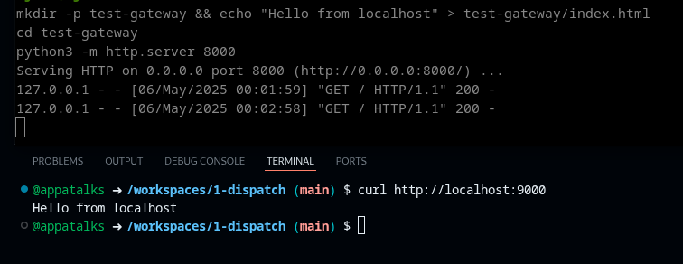
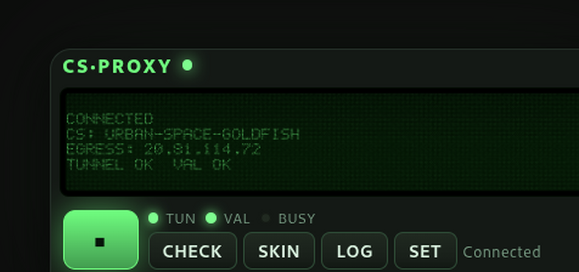

# cs-proxy
### GitHub Cli Extension: Proxy-Gateway & VPN for Codespaces <p><p>

> [!NOTE]
> This project aims to be a replacement for the no longer maintained as described GH CLI [Extension](https://docs.github.com/en/codespaces/developing-in-a-codespace/connecting-to-a-private-network#using-the-github-cli-extension-to-access-remote-resources) for _access to remote resources_ in GitHub documentation.

Send chosen internet traffic through your GitHub Codespace with [`sshuttle`](https://github.com/sshuttle/sshuttle)([**download**](https://sshuttle.readthedocs.io/en/stable/installation.html#)), and optionally open a reverse SSH tunnel so the Codespace can reach services running on targeted local/private networks.


 <p> 
Image: `gh cs-proxy connect my-codespace --gateway`

<p>
 
----

## Desktop App (GUI)

The [`app/`](app/) folder contains a cross-platform Electron desktop app that wraps the entire tunnel flow in a compact, frameless interface. It runs on Linux and macOS.

**What it does.** Pick or create a Codespace, press play, and the app handles authentication, codespace startup, sshuttle routing, and tunnel validation in one shot. Press stop to tear everything down. The codespace can be left running, stopped, or deleted depending on your settings.

**What it looks like.** Frameless window with frosted glass transparency, rounded corners, and a canvas-rendered dot-matrix display showing live tunnel status. Five built-in color themes (Green Phosphor, Amber CRT, Ice Blue, Synthwave, LCD). Window opacity is adjustable from the settings panel.



**Settings** open in a separate tabbed window (Connection, Routing, Appearance, System) so you have room to configure without squinting at the compact main interface.

### Quick start

```bash
cd app
npm install
npm start
```

### Build a standalone binary

```bash
npm run dist           # Linux AppImage + deb
npm run dist:mac       # macOS dmg
npm run dist:all       # all platforms
```

### Using the AppImage (Linux)

Grab the AppImage from the `app/dist/` directory after building, or from the releases page.

```bash
chmod +x CS-Proxy-*.AppImage
./CS-Proxy-*.AppImage
```

No installation required. The binary is self-contained and runs from anywhere. Your settings are stored in `~/.config/CS-Proxy/`.

`gh`, `sshuttle`, and `ssh` still need to be available on the host. The app will check for them on startup and can auto-install missing tools if enabled in Settings > System.

See [app/README.md](app/README.md) for routing modes, the one-time firewall authorization, and security notes.

----
 
## Installation

```bash
gh extension install appatalks/cs-proxy
chmod +x ~/.local/share/gh/extensions/cs-proxy/cs-proxy
```

## Usage

```bash
gh cs-proxy connect <codespace-name> [flags]
```

## Flags

```txt
`--all`             Route all traffic (0.0.0.0/0) through the Codespace
`--only-443`        Route only HTTPS/TLS traffic (0.0.0.0/0:443)
`--dns`             Include DNS queries in the tunnel
`--domains "..."`   Route HTTPS traffic for specific domains (space-separated list)
`--gateway`         Set up a reverse SSH tunnel so the Codespace can reach your localhost (default local:8000 → remote:9000)
`-h`,`--help`       Show usage
```
```bash
gh cs-proxy help
Usage: gh cs-proxy connect <codespace-name> [--all] [--dns] [--only-443] [--domains "domain1 domain2"] [--gateway]
```

## Examples

1. Route only TLS + DNS:
  ```bash
  gh cs-proxy connect my-codespace --only-443 --dns
  ```

2. Route GitHub domains + set up local gateway:
  ```bash
  gh cs-proxy connect my-codespace --domains "github.com api.github.com" --gateway
  ```

3. Route all traffic:
  ```bash
  gh cs-proxy connect my-codespace --all
  ```

4. Custom local port mapping (optionally, use env vars before running):
  ```bash
  export LOCAL_PORT=3000 REMOTE_PORT=9001
  gh cs-proxy connect my-codespace --gateway
  ```
<br>

 ###### `Appa's Thoughts: Epic.`
